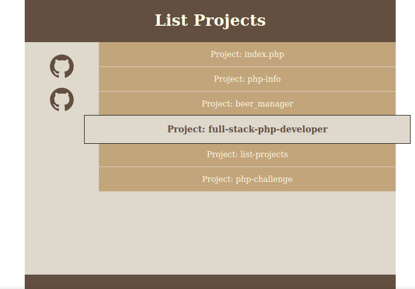

# Lista Projetos(Localhost)

## Objetivo:
Este projeto tem o objetivo de aprendizado de technologias como PHP para listar os diretorios e formatação da pagina com o CSS utilizando grid e efeitos no menu.

## Projeto
Para usalo somente coloque no diretorio onde estao os outros projetos e ele listara os mesmos.

## Preview da pagina:

## Tecnologia utilizada:
* PHP
* HTML
* CSS
* GIT e GitHub
